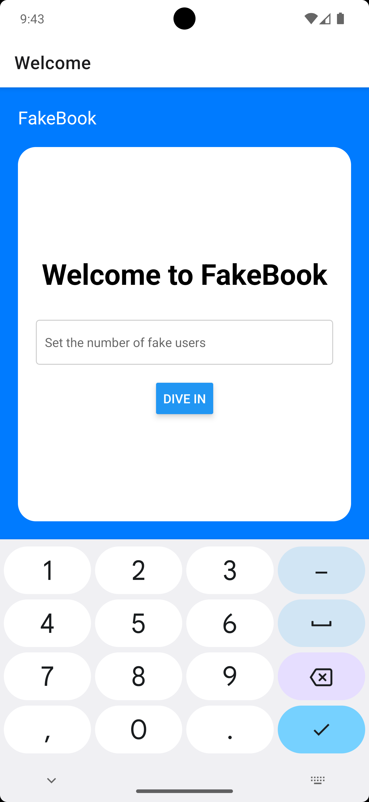

# FakeBook Mobile App

FakeBook is an interactive, educational mock-up app designed to simulate social networking experiences for learning purposes. Developed with React Native, it mirrors the functionalities of a web version by utilizing a mock API to generate and display user data across its components.

- **Home Page**: Set the scene with a custom number of generated users, ready to populate your fake social network.
- **User List Page**: Scroll through a list of fake profiles, each equipped with a unique identity, created on-the-fly for demonstration.
- **Profile Detail Page**: Dive into the details of a fake person, complete with interactive message and follow buttons to simulate social interactions.

Built as a school project, FakeBook serves as an excellent educational tool, enhancing understanding of mobile app development and API integration.

## Screenshots

### Home Page

### User List Page

### Profile Detail Page
